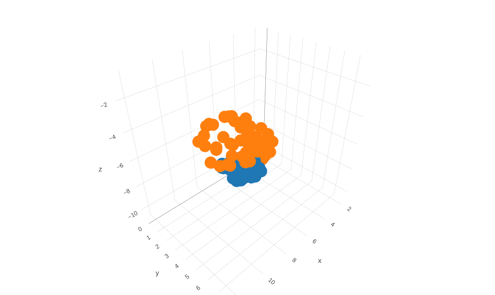
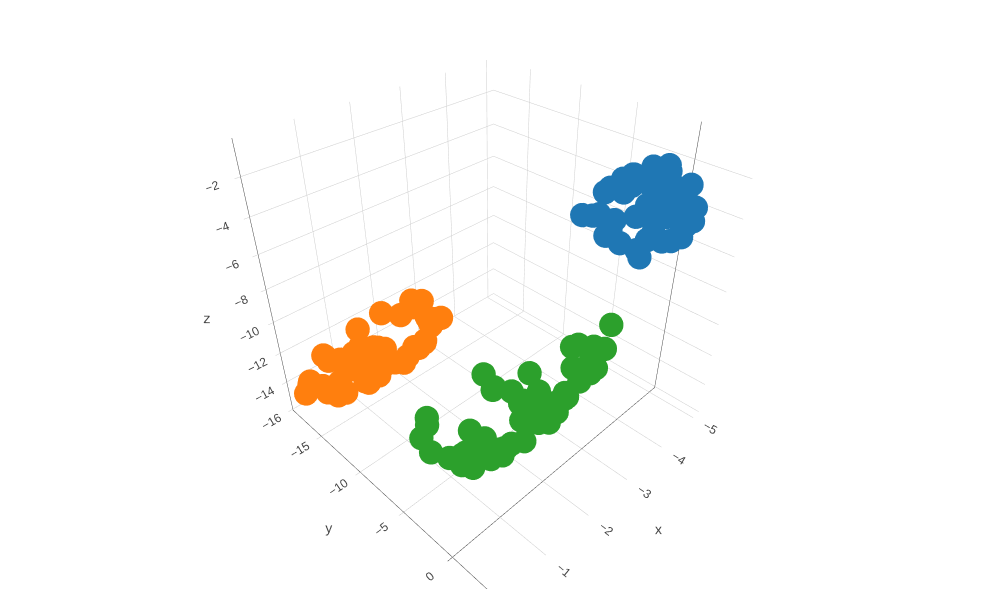
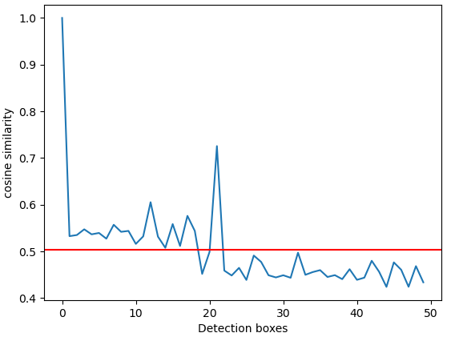
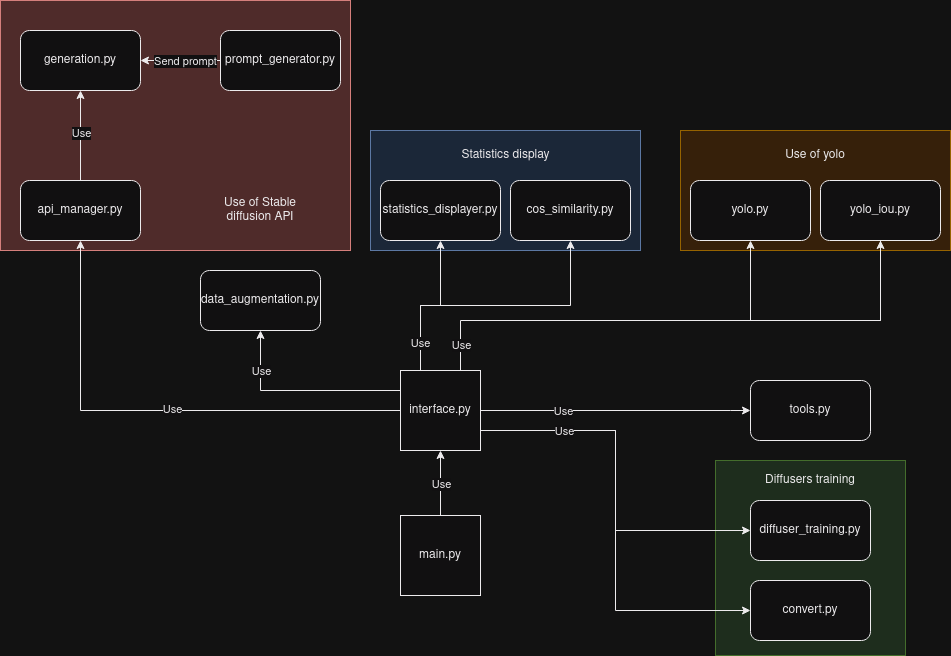

# Data generation using Stable diffusion

## Content

click to expand

 - [Installation](#installation)
 - [Generate data using Stable diffusion](#stable)
 - [Generate data using Controlnet](#controlnet)
 - [Statistics](#statistics)
 - [Tools](#tools)
 - [Code](#code)
 - [Diagram](#diagram)
 - [Technology](#technology)
 - [Sources](#sources)

# <a id="installation" />Installation

	# Clone yolov7 in the project
	git clone https://github.com/WongKinYiu/yolov7.git
	cd yolov7
	pip install -r requirements.txt
	cd ..

Follow the tutorial to install [stable-diffusion-webui](https://github.com/AUTOMATIC1111/stable-diffusion-webui)	

Follow the tutorial to install [Controlnet-webui](https://github.com/Mikubill/sd-webui-controlnet)

If Controlnet is able to generate images using webui then the installation is done.

After that, you can train with the webui hyper-networks and embeddings, you must put the name and the input of text embeddings and hyper-networks in config.json.
Then, run init.sh to initialize the project folders (they are created from config.json).

To use webui for generation, you can run :
    
        ./launch.py
or by running main.py.

# <a id="stable" />Stable diffusion

Stable diffusion can generate data from scratch, you can choose your prompt or generate a random prompt (customizable in src/prompt_generation), you can also choose number of steps and number of images to generate.
Run yolo in tools to get the bounding boxes of the generated images. using yolov7.pt

# <a id="controlnet" />Controlnet

Controlnet can generate data with predefined bounding boxes, in img, you can upload your own images that you want controlnet to generate new data from, each pictures must have a .txt files with the same name as the images. The bounding boxes in this files must be in yolov7 format (class, centerx, centery, width, height).

Go in Controlnet tab and input the number of images that you want to generate.

# <a id="statistics" />Statistics

Some statistics are available to display :

Umap between controlnet detection boxes and blueprint pictures

Umap between stable diffusion, controlnet and bdd100k pictures

Cosine similarity

# <a id="tools" />Tools

## *Yolo detection*

This tool use yolo to detect bounding boxes in controlnet generated images.
It uses iou to compare ground truth bounding boxes and predicted bounding boxes.
If the iou is greater than the threshold between the two bounding boxes, the bounding box is considered as detected.

The function will create a folder with images and .txt files with detected bounding boxes.
It should allow us to use the generated objects that are well-made and not the ones that could be modified and unrecognizable.

## *Merge datasets*

Merge is used to merge 2 datasets (img and txt) in one dataset.
This way, we can make datasets by combining different images from different
generation methods, or from different datasets.

## *Analyze datasets*

This tool is used to show repartition between classes in a dataset.

## *Random images*

This tool get random images from a dataset, to put it in the images blueprint folder.
This way, we can easily get datas for controlnet generation.

## *Run yolo*

Run yolo for each images in a folder, and save the results in a txt or, for stable diffusion, in a txt file for each image.
Options are available to choose the confidence threshold and which kind (aerial view or ground view) the model is supposed to detect.

## *Display statistics*

It is used with controlnet after running yolo, to compare how many bounding boxes are detected and how many are not detected.
It plots the distribution for each predefined words in the prompt generation.
It also plots the distribution of good detection and bad detection, it is determined with a threshold.
For example if an image is supposed to have 10 bounding boxes, and 8 are detected, it is considered as a good detection, based on the threshold (if threshold is below 0.8, it is considered as a good detection).

## *Display bboxes*

Show for a path the images with the corresponding .txt bounding boxes.
The .txt must be in yolo format.

## *Data augmentation*

Data augmentation can be run on a folder, results will be in the generated image's folder.
For the moment, it hasn't shown good results, but it can be improved.

# <a id="code" />Code
A diagram is available below code explanation to understand interactions between files.

main.py

Main is (obviously) the main file, it is used to run the project.
It's the one file load when using the shell command line ./launch.sh
It contains one function.

### init_tabs() :
Init the tabs of the interface, to add a new tab, create it in interface.py and add it here.
Also contains an integrated monitor to display prints.
It contains 3 tabs :
- Stable diffusion
- Controlnet
- Tools

Tools contains more tabs containing tools to use on the datasets.

interface.py

Interface function contains all the tabs of the interface, it is used to display the interface.
It contains 3 classes:
- Butt (interface for buttons)
- Input (interface for inputs)
- Output (interface for outputs)

These classes are used to create the interface, they are used in different tabs depending on the needs.

Now let's review all functions.

### get_path() :
Get path from filedialog and return path as a string.

### update_terminal(root, temp, out) :
Update the console in the interface, it is used to display prints in the interface.

### stable_diffusion_generation_tab(tab_generation) :
Create the tab for the image generation using stable diffusion webui.
Config is used to get the config.json file, it is used to get the path of the images and the path of the embeddings...

### controlnet_tab(tab_controlnet) :
Create the tab for the controlnet generation, also used config.json to get the path of parameters.

From here, tabs are all in tools tab.
### tools_tab(tab_tools) :
Launch comparison between CN and yolo files.

### analyze_tab(tab_analyze) :
Launch analyze of a dataset, it will show the repartition of classes in the dataset.

### merge_tab(tab_merge) :
Create the tab for the data merger, it will merge 2 datasets in one.

### add_random_tab(tab_get_random) :
Create the tab for the random data generator, it will get random images from a dataset
and add it to the blueprint folder, so that controlnet can generate new data from it.

### run_yolo(tab_run_yolo) :
Create the tab for yolo to run, on stable diffusion or controlnet generated images.
You can also choose weight and confidence threshold.

### statistics_tab(tab_statistics) :
Create the tab for the statistics. Stable diffusion  isn't available for the moment.
You must run yolo before running statistics, as yolo results are needed to run it.

### display_bbox_tab(tab_display_bbox) :
Create the tab for the display bbox, it will show images with the corresponding bounding boxes.
It uses yolo format.

### data_augmentation_tab(tab_data_augmentation) :
Create the tab for the data augmentation.

### yolo_iou_tab(tab_yolo_iou) :
Create the tab for yolo iou, to compare the iou of yolo and controlnet.

api_manager.py

Api manager is used to verify if the api is running, if not, it will launch it.
This way we can't run 2 api and crash the pc.

### number_of_files(directory) :
Get the number of files in a directory based on the number of .png files or .jpg files.

### api_close() :
Cancel the API, by killing the process

### api_monitor() :
Monitor the API, if it is not up, launch it

### print_images_info(path_of_generated_images, num_img) :
Print images information, it will print the number of images in the folder and the number of images to generate.

### load_api(num_img, payload_webui, is_controlnet, choice, hypernetwork, embedding, model) :
Load the API, generate images based on config, this function will use generation.py functions.

generation.py

Manage images generation using webui. Create a defined number of images.

### run_stable_diffusion(payload_webui, number_of_images_to_generate, choice, num_img, hypernetwork, embedding):
Run stable diffusion on config path, manage the files and folders.

### run_controlnet(payload_webui, quantity_to_generate, directory_img_control, hypernetwork, embedding, model):
Run controlnet on config path, manage the files and folders.

prompt_generator.py

File containing all functions to generate prompts.

We'll review only 2 functions, as the others are just string generators.

### words_list(is_string) :
Function to get a list of words, if is_string = 0, return all lists of words. 
If is_string = 1, return adjective list only. Else, return all lists of words
as a string.

### prompt_generator(use):
Generate a random prompt for the API, depending on the use parameter.
1 = stable diffusion prompt
2 = controlnet prompt

tools.py

File containing all tools functions.

### add_random(path_to_folder, number_of_images):
Function to add random files from a folder to another folder.
Rename the files to avoid conflicts.

### class_repartition(path_to_folder):
Function to count how many car, 
pedestrian and others are in a folder (repartition of classes)

### add_quantity(path_to_get, path_to_add):
Function to add quantity of files from a folder to another folder, and rename them to match the number of files in the folder.

### display_bbox(path):
Display the bounding box of images in a folder (1 txt for 1 img), (yolo format).

yolo.py

File to manage yolo. It modifies some .txt files with datas from yolo.

### numerical_sort(value):
Sorter for numerical values. Sort from ascending order.

### yolo_run(weight, path_images, conf):
Run yolo on config path, manage the files and folders.

yolo_iou_manager.py

Use .txt files to compare yolo prediction and ground truth bounding boxes.
It will create a folder with images containing the bounding boxes corresponding to the input
threshold.

### get_iou(bb1, bb2):
Calculate the Intersection over Union (IoU) of two bounding boxes.

### convert_format(line):
Convert the format of the line from yolo to x_min, y_min, x_max, y_max.

### compare(path_img, yolo_file, threshold):
Compare the predictions of yolo with the ground truth.

data_augmentation.py

Manage data augmentation for images, create a folder with the augmented images 
without modifying the original folder. We review only 2 functions, as the others are just
way of augmenting images (blur, noise, darken)

### random_augmentation(path_img):
Randomly augment the image, with blur, darken and noise, or not. Augmentation can be done multiple times on the same image.

### augment_folder(path_folder, path_folder_augmented):
Augment all the images in the folder, and save them in the augmented folder.

init.py

Initiate folder and files for the project.

### init_directory():
Initiate the directory for the project, create all folders needed.

statistics_displayer.py

Display statistics about the images in the folder.

### add_word(string_words, data_prediction, list_of_words, i):
Add a word to the string_words, and add the number of detection to the data_prediction.

### statistic(path, prediction, threshold):
Function to plot statistic of a folder of generated images.

### plot_by_synonymous(all_words_removed, string_words):
Function to plot words that are the most present in files that should be deleted

### plot_deleted(number_of_detection, number_of_detection_kept, data, all_words_kept, all_words_removed, string_words):
Plot the number of detection kept and deleted, and the words that are the most present in files that should be deleted.

diffuser_training.py

File to train the Unet of a stable diffusion model.

### make_grid(images, rows, cols):
Make a grid of images.

### evaluate(config, epoch, pipeline):
Evaluation for the trained model

### train_loop(config, model, noise_scheduler, optimizer, train_dataloader, lr_scheduler):
Manage the train loop 

### train_stable():
Train model, config are in  this file.

convert.py

Conversion for diffusers models

### convert_file(pt_filename: str, sf_filename: str,):
Convert a .bin file to .safetensors file

# <a id="diagram" />Diagram
	

# <a id="sources" />Sources

https://arxiv.org/abs/2207.02696

https://arxiv.org/abs/2112.10752

https://arxiv.org/abs/2103.00020

https://arxiv.org/abs/1312.6114

https://arxiv.org/abs/1505.04597

https://arxiv.org/abs/2302.05543
